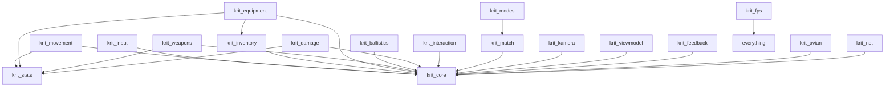

# Krit FPS: Crate Architecture Plan

> Status: **proposal**, targeting Bevy 0.19, `bevy_enhanced_input` (BEI) 0.26 and avian3d 0.7.
> This document defines how the workspace is split into crates, what each crate owns, and the
> exact contracts that cross every crate boundary.

## 1. Goals

1. **Use it whole.** `krit_fps` (the facade) plus `KritFpsPlugins` gives a working FPS sandbox.
   That covers moving, looking, picking up and firing a weapon, dealing damage, dying and respawning
   in a deathmatch.
2. **Use it piece by piece.** Any domain crate can be used alone, or replaced with a game's own
   implementation, without forking the others. A developer who wants their own movement keeps
   Krit's weapons, damage and match flow untouched.
3. **Support many first-person games**, not only arena shooters. Examples are Quake-likes,
   tactical/military shooters, extraction games, immersive sims, horror games and single-player
   campaigns.
4. **Be ready for networking from day one.** Simulation is deterministic, runs on a fixed tick, and
   keeps all of its state in components. A lightyear or replicon integration should be *additive*
   and should not require a rewrite.

## 2. Architectural principles

These come from the research into Bevy, Lyra, Source/Quake, Unity DOTS, Godot and Overwatch. Every
crate below follows them.

| # | Principle | Origin |
|---|---|---|
| P1 | **Intent is the only gameplay input.** Simulation reads plain intent components and never reads devices or BEI. Players, AI bots, replays and network prediction all drive the same code. | Unity Starter Assets, Source `CUserCmd`, DOTS player→character |
| P2 | **Simulation and presentation are separate.** Simulation runs in the fixed schedule and is headless-safe. Camera feel, view models, VFX, audio and HUD only *read* simulation state and never write it. | Overwatch, lightyear rollback rules |
| P3 | **Intent flows down; facts flow up as events.** Fire intent → `ShotRequest` → `HitResult` → `DamageRequest` → `DamageApplied` → `Died`. Every arrow is a seam where a stage can be replaced. | Overwatch deferment, DOTS shot buffers |
| P4 | **Aim belongs to the character, not the camera.** `ViewAngles` lives on the character. The camera copies it and adds visual-only offsets. | Source, DOTS `ViewPitchDegrees`, bevy_ahoy `CharacterLook` |
| P5 | **Player and Character are separate entities.** The persistent player (team, score, loadout choice) lives on the Player. The Character (body) can be destroyed and respawned. | Lyra PlayerState/Pawn, DOTS `ControlledCharacter` |
| P6 | **Compose, don't inherit.** A weapon is an entity made of `FireMode`, `Magazine`, `SpreadModel` and similar components. A `Hitscan` or `Projectile` marker component picks which systems process it. | DOTS weapons vs ShooterGame/Source hierarchies |
| P7 | **Stats are a base value plus a list of modifiers, recomputed when the inputs change.** Never mutate base data. | Lyra/GAS attributes |
| P8 | **Rules are policies that systems query.** Friendly fire, whether damage is allowed, and spawn choice are resources or gate components. No crate contains `if mode == SnD` checks. | Source `CGameRules`, Lyra phase/team subsystems |
| P9 | **Physics sits behind a trait.** Core logic uses a `SpatialQuery`-style trait, and backend crates implement it. | Quake `pmove` trace callbacks, bevy-tnua integration layer |
| P10 | **Every crate ships a `PluginGroup` of fine-grained plugins and public `SystemSet`s.** This lets users run `.disable::<X>()`, `.set(...)`, `remove_systems_in_set`, and order their own systems against ours. | Bevy `DefaultPlugins`, bevy_ahoy, tnua |

## 3. Crate map

```
krit_fps                         facade: features, KritFpsPlugins, prelude
│
├── krit_core                    contracts: ids, intents, events, sets, gates, physics traits
├── krit_stats                   generic StatId + Modifier + recompute
│
├── krit_input                   BEI → intent bridge                       (sim-adjacent)
├── krit_movement                KCC, movement state machine, profiles     (simulation)
├── krit_inventory               items, slots, ammo pools, pickups         (simulation)
├── krit_equipment               equip/holster, active item, intent routing (simulation)
├── krit_weapons                 fire control, ammo, reload, spread, recoil (simulation)
├── krit_ballistics              hitscan, projectiles, penetration, AoE, hitboxes (simulation)
├── krit_damage                  health/armor/shield pipeline, life state, attribution (simulation)
├── krit_interaction             focus, hold-to-use, interactables         (simulation)
├── krit_match                   phases, teams, score, spawns, respawn     (simulation)
│   └── krit_modes               TDM / FFA / CTF / Domination / S&D … (feature-gated plugins)
│
├── krit_kamera                  camera rig, FOV, bob/shake/kick, camera modes (presentation)
├── krit_viewmodel               view-model render layer & weapon sway     (presentation, render deps)
├── krit_feedback                hitmarkers, killfeed, damage indicators, HUD read models (presentation)
│
├── krit_avian                   avian3d backend for krit_core physics traits
└── krit_net        (later)      lightyear/replicon integration, lag compensation history
```

The existing crates fit into this map: `krit_input` stays as it is (with changes described in §7),
and `krit_kamera` stays as the presentation camera.

### 3.1 Dependency graph



**The one hard rule:** apart from the explicit exceptions below, domain crates depend only on
`krit_core` and `krit_stats`, never on each other. All communication between domains goes through
`krit_core` types.

| Allowed sibling edge | Why |
|---|---|
| `krit_equipment → krit_inventory` | Equipment works on inventory items. Lyra layers them the same way. Inventory knows nothing about equipment. |
| `krit_modes → krit_match` | Modes are thin rule plugins built on the match framework. |
| `krit_avian / krit_net → krit_core` only | Backends implement core traits and do not reach into domain crates. Domain crates expose backend hook sets instead. |

Not allowed (each would break the ability to swap that crate):

- weapons → ballistics, because firing must not know how hits are resolved;
- ballistics → damage, because hits must not know how health works;
- damage → match, because death must not know about scoring;
- anything in simulation → kamera, viewmodel or feedback.

### 3.2 Bevy dependency tiers

| Tier | Crates | Bevy deps allowed |
|---|---|---|
| Logic | core, stats, input, movement, inventory, equipment, weapons, ballistics, damage, interaction, match, modes | `bevy_app`, `bevy_ecs`, `bevy_math`, `bevy_reflect`, `bevy_transform`, `bevy_time`, `bevy_platform` (+ `bevy_asset` for definition assets) |
| Presentation | kamera, feedback | add `bevy_camera` |
| Render | viewmodel | add `bevy_render`, `bevy_camera`, `bevy_light` |
| Backend | avian, net | add `avian3d`, `lightyear` / `bevy_replicon` |

Logic crates must build and pass tests with **no renderer and no physics engine**. CI should enforce
this with `cargo test -p krit_weapons` and similar per-crate runs.

## 4. Schedule & ordering backbone (owned by `krit_core`)

Every crate places its systems in one shared, public set chain. That way crates that never import
each other still run in the right order.

```rust
/// Simulation (runs in the configurable sim schedule, default FixedUpdate)
#[derive(SystemSet, Debug, Clone, PartialEq, Eq, Hash)]
pub enum KritSimSystems {
    /// Copy/validate intents for this tick; apply gates (freeze time, dead, menus)
    Intent,
    /// ViewAngles integration (look) + recoil-to-aim application
    Aim,
    /// Character movement (KCC). Physics backend runs around this.
    Movement,
    /// Equipment changes, intent routing to the active item
    Equipment,
    /// Weapon state machines -> ShotRequest
    Weapons,
    /// ShotRequest + projectiles -> HitResult -> DamageRequest
    Ballistics,
    /// DamageRequest -> DamageApplied / Died
    Damage,
    /// Interaction progress
    Interaction,
    /// Match rules: scoring, phase transitions, spawn requests
    Rules,
    /// Spawning/despawning of characters, cleanup
    Lifecycle,
}

/// Presentation (Update / PostUpdate, never in the sim schedule)
#[derive(SystemSet, Debug, Clone, PartialEq, Eq, Hash)]
pub enum KritViewSystems { SyncFromSim, CameraEffects, ViewModel, Feedback }
```

- `KritCorePlugin { sim_schedule: Interned<dyn ScheduleLabel> }` chains these sets. The sim schedule
  is configurable so that lightyear or physics schedules can be used.
- Users gate the whole simulation with
  `configure_sets(FixedUpdate, KritSimSystems::Intent.run_if(in_state(MyState::Playing)))`.
  Krit never defines the game's top-level `States`.
- Inside each crate, sub-sets are public (for example `WeaponSystems::{FireControl, Reload, Spread, Recoil}`)
  so individual behaviours can be removed with `App::remove_systems_in_set` or have systems inserted
  between them.
- **Bridge between frame rate and tick rate**: input gathered every frame is accumulated and then
  cleared in `RunFixedMainLoopSystems::AfterFixedMainLoop`, and only if a fixed tick actually ran that
  frame. This is the bevy_ahoy pattern, and it fixes the double-tick bug described in §7.

### 4.1 Event vs Message vs Component: which mechanism for which contract

| Use | Mechanism | Examples |
|---|---|---|
| Per-tick state another domain reads | **Component** on the entity | `CharacterIntent`, `ViewAngles`, `ActionGates`, `WeaponStats`, `Health` read models |
| High-volume pipeline handoff between sim stages | **`Message`** (buffered, read in order by the next set) | `ShotRequest`, `HitResult`, `DamageRequest`, `DamageApplied` |
| Discrete, low-volume facts users want to react to per entity | **`EntityEvent`** (observers, optionally propagating up `ChildOf`) | `Died`, `Landed`, `WeaponFired`, `ReloadFinished`, `Equipped`, `InteractCompleted` |

Pipeline stages use `Message` because observers have no ordering between them, and because a
replaced stage should only need to read one queue and write the next. Facts are *also* triggered as
`EntityEvent`s where game code commonly wants `On<Died>`-style observers. Keep the two in sync with
a small helper in core.

## 5. Crate-by-crate specification

Every crate has the same layout:

- `XPlugins` (a `PluginGroup`) made up of fine-grained `pub` plugins;
- a `prelude`;
- `XSystems` sets;
- components that are `Default + Clone + Reflect` (BSN/`FromTemplate` friendly), with `MapEntities`
  on any component that holds an `Entity`;
- a `serialize` feature.

### 5.1 `krit_core`: contracts

**Owns:** only types, traits, sets and tiny pure helpers. It has no gameplay systems except the set
configuration and generic gate application.

| Module | Contents |
|---|---|
| `tick` | `SimTick(u32)` resource, incremented in `KritSimSystems::Intent`. Every event carries a tick. |
| `entity` | `Player`, `Character`, the relationship `Controls(Entity)` ↔ `ControlledBy`, `Owner` / `Instigator` relationship for spawned things (projectiles, grenades) |
| `intent` | `CharacterIntent` (see §6.1), `Buttons` bitflags with pressed/held/released edges, `ItemIntent` |
| `aim` | `ViewAngles { yaw, pitch }`, `AimRecoil { pitch, yaw }` (aim-affecting), `EyeHeight`, `AimRay { origin, dir }` helper fn |
| `gates` | `ActionGates` bitflags (`MOVE`, `LOOK`, `FIRE`, `ADS`, `SPRINT`, `INTERACT`, `SWITCH`, `RELOAD`) as a component. Domains *contribute* blocks; consumers *query* them. |
| `team` | `TeamId`, `Team` component, the `TeamRelations` resource trait (`relation(a, b) -> Relation::{Self_, Friendly, Neutral, Hostile}`) with a default impl |
| `combat` | `ShotRequest`, `HitResult`, `HitZone`, `Hurtbox { owner, zone, multiplier }`, `DamageRequest`, `DamageApplied`, `Died`, `DamageTypeId`, `DamageFlags`, `ImpactEvent` |
| `physics` | `SpatialQueryBackend` trait (ray cast, shape cast, overlap, with layer filters), `CollisionLayers` mapping, `KritLayer::{World, Character, Hurtbox, Projectile, Interactable}` |
| `rng` | `SimRng::for_shot(tick, shooter, shot_index)`: seeded, deterministic, predictable |
| `sets` | `KritSimSystems`, `KritViewSystems`, `KritCorePlugin` |

**Customization:** you would swap backend implementations, not this crate. Any game needs it, even
one that uses only a single Krit crate.

### 5.2 `krit_stats`: modifiers

**Owns:**
- `StatId`: an interned id or label, extensible;
- `Modifier { stat, op: Add | Mul | Override, value, priority }`, stored as `Modifiers` on the source
  entity (an attachment, perk, equipped item or status effect);
- `ModifierSourceOf(target)` relationship;
- a generic `Stat<T>` recompute pattern. A domain declares `BaseX` + `X` (computed) and registers
  which `StatId`s feed which fields.

**Consumes:** `Modifiers` changes and relationship add/remove events.

**Produces:** recomputed stat components (`WeaponStats`, `MovementStats`, `HealthStats`) whenever a
source is added, removed or changed.

**Why a crate of its own:** movement (weight, ADS slowdown), weapons (attachments) and damage (armor
perks) all need it. Putting it in core would make core opinionated, and putting it in weapons would
make movement depend on weapons.

### 5.3 `krit_input`: device → intent bridge

**Owns:**
- the BEI `InputAction` types (`Movement`, `Jump`, `Crouch`, `Sprint`, `RotateCamera`, `Fire`,
  `AltFire`/`Aim`, `Reload`, `Interact`, `SwitchSlot(n)`, `NextItem`, `PrevItem`, `Melee`, `Throw`,
  `Lean`);
- default input contexts and bindings;
- `InputSettings` (sensitivity, invert, ADS sensitivity mode, toggle-vs-hold per action);
- frame-to-tick accumulation.

**Consumes:** BEI `Fire`/`Start`/`Complete` events, and `Action<T>` component values for continuous
axes.

**Produces:** writes `CharacterIntent` on the **Character**. The look delta is already scaled by
sensitivity, and toggle/hold is already resolved into "wants crouch" state.

**Plugins:**
- `KritInputActions`: the action types plus contexts;
- `KritInputAccumulation`: frame-rate accumulation, the default for single player;
- `KritInputPerTick`: evaluates BEI in `FixedPreUpdate`, as lightyear does, for networked games;
- `KritInputSettings`.

**Customization:** replace the whole crate with your own `CharacterIntent` writer, for example
leafwing, a bot or a replay. No other Krit crate imports `krit_input`.

**Boundary:** this is the *only* crate that depends on `bevy_enhanced_input`. Items push their own
input contexts on equip by listening to `krit_equipment`'s `Equipped` event in an *input-side*
observer, rather than equipment importing BEI.

### 5.4 `krit_movement`: character motion

**Owns:**
- `CharacterController` (tuning parameters);
- `MovementProfile` (an asset or component: Quake/Source, Arcade, Tactical, Immersive presets);
- `MovementState`, the state-machine enum (`Ground`, `Air`, `Crouch`, `Slide`, `Prone`, `Ladder`,
  `Swim`, `Mantle`, `Noclip`), extensible through a `CustomMovementState` hook;
- `KinematicState` (velocity, grounded, ground normal, ground entity, timers such as coyote time);
- `Stamina`;
- `MovementStats`, computed through `krit_stats`;
- capsule height changes;
- applying look integration to `ViewAngles`, in `KritSimSystems::Aim`.

**Consumes:**
- `CharacterIntent`: move, jump, crouch, sprint and look;
- `ActionGates`;
- `MovementStats` modifiers from equipment;
- `ExternalImpulse` (knockback from explosions, jump pads).

**Produces:**
- `Transform` and velocity;
- `ViewAngles` (yaw/pitch, with pitch clamped);
- `MovementSpreadFactor`, a 0..1 value that weapons read;
- `ActionGates` contributions (no ADS while sprinting or on a ladder);
- `Landed { fall_speed }`, `Jumped` and `StateChanged` events;
- `NoiseEvent` for footsteps;
- a `DamageRequest` for fall damage (type `Fall`).

**Physics boundary:**
- The core step is a pure function, `fn step(state, intent, stats, &impl CollisionQuery, dt) -> state`.
  This is the Quake `pmove` model, which makes it unit-testable and rollback-safe.
- `krit_avian` provides `CollisionQuery` by wrapping Avian's `MoveAndSlide`. The KCC is where
  backend-specific code is most likely to grow, so it stays in `krit_avian`, never in `krit_movement`.

**Plugins:** `MovementCore`, `MovementLook`, `MovementCrouch`, `MovementSprint`, `MovementSlide`,
`MovementLadder`, `MovementSwim`, `MovementMantle`, `MovementStamina`, `FallDamage`. Each can be
disabled on its own.

**Customization:**
- pick a profile;
- disable features;
- add custom states with a hook trait;
- or replace the crate. Anything that writes `Transform`, `ViewAngles` and `MovementSpreadFactor`
  satisfies the boundary. This includes adopting `bevy_ahoy` through a thin adapter (see §9).

### 5.5 `krit_inventory`: what you carry

**Owns:**
- `Inventory` (on the **Player**, so it survives a body's death if the game wants that), or on the
  Character, as configured;
- `InventorySlots` layout (`Primary`, `Secondary`, `Melee`, `Lethal`, `Tactical`, `Gadget`, or a
  custom/grid layout);
- items as entities linked through the `InInventory(owner)` ↔ `InventoryItems` relationship;
- `ItemDefinition` assets with optional "fragment" components (Lyra-style): `Equippable`, `Stackable`,
  `AmmoType`, `Pickup`;
- `AmmoPool` keyed by ammo type;
- pickup and drop systems, and `LoadoutDefinition` assets.

**Consumes:**
- `PickupRequest`, from interaction or overlap;
- `GrantLoadout { player, loadout }`, from match spawn;
- `DropRequest`, and drop-on-death policy (it reacts to `Died` as an observer, gated by
  `DropOnDeath`).

**Produces:**
- `ItemAdded`, `ItemRemoved` and `AmmoChanged` events;
- the item entity graph that equipment reads.

**Boundary:** it knows nothing about equipping or firing. An item is just an entity with a definition.

### 5.6 `krit_equipment`: what you are holding

**Owns:**
- `EquipmentSlots` on the Character, holding the active slot and the last slot for quick-switch;
- the `EquippedBy(character)` ↔ `Equipment` relationship;
- the `ActiveItem` marker;
- the switch state machine (`Holstering` → `Equipping`, using `equip_time` / `holster_time` from
  stats);
- attachment entities as `AttachedTo(item)`, which are also `krit_stats` modifier sources;
- the `ViewSocket` entity under the character's eye, which items are parented to.

**Consumes:**
- `CharacterIntent` (switch, next, prev, last);
- `ActionGates` (`SWITCH`);
- inventory relationships.

**Produces:**
- **Intent routing.** Each tick, the active item gets an `ItemIntent { primary, secondary, reload,
  melee, … }` copied from the holder's `CharacterIntent`, as in the DOTS sample. Items never look up
  their holder's intent themselves.
- `Equipped`, `Holstered` and `ActiveItemChanged` events.
- `ActionGates` contributions: no fire while switching.
- `MovementStats` modifiers from the active item's weight.

**Boundary:**
- Weapons do not depend on equipment. A weapon is just an entity holding `ItemIntent`, `ViewSocket`
  parenting and an `Owner`.
- Equipment works for non-weapon items too (flashlight, medkit, scanner, keycard). This matters for
  horror and immersive-sim games.

### 5.7 `krit_weapons`: deciding to shoot

**Owns** per-weapon-entity components:
- `WeaponState` machine: `Idle`, `Firing`, `Cooldown`, `Reloading { phase }`, `Charging`, `Cooking`;
- `FireMode` (`Semi`, `Auto`, `Burst { n, delay }`, `Charge { min, max }`, `Cycle` for pump/bolt),
  plus a `FireModeSelector`;
- `FireRate` (RPM) with a **sub-tick accumulator**, so 1200 RPM at 60 Hz produces several shots per
  tick;
- `Magazine`, `Chamber` and `AmmoSource` (`Infinite`, `OwnerPool(ammo_type)` or `Internal`);
- `ReloadSpec` (tactical vs empty, per-shell, and a commit point given as data rather than as an
  animation event);
- `SpreadModel` (base by state, bloom per shot, decay, first-shot accuracy, Lyra-style heat curves);
- `RecoilModel`, which is either `Pattern(Vec<Vec2>)` (CS-style) or `Random { … }`, plus recovery;
- `AdsState` (0..1 progress);
- `Melee` and `Throwable` (cook, fuse) as separate optional components;
- `WeaponStats`, computed through `krit_stats`;
- `WeaponDefinition` assets.

**Consumes:**
- `ItemIntent`;
- the owner's `ActionGates`, `MovementSpreadFactor` and `ViewAngles`/`EyeHeight` (read through
  `Owner`);
- `WeaponStats`;
- the owner's ammo pool, read through `krit_core`'s `AmmoProvider` trait so that it never imports
  inventory.

**Produces:**
- `ShotRequest` messages, one per shot (pellets are inside the request);
- `AimRecoil` deltas on the owner, which affect aim;
- `WeaponFired { shot_count_total }`, a cumulative counter that presentation and remote clients use
  to recreate cosmetics;
- `ReloadStarted`, `ReloadFinished`, `DryFire`, `FireModeChanged` and `AdsChanged`;
- an `ActionGates` contribution (no sprint while ADS, if the profile says so);
- `CurrentSpread`, a read model for the crosshair.

**Plugins:** `WeaponFireControl`, `WeaponAmmo`, `WeaponReload`, `WeaponSpread`, `WeaponRecoil`,
`WeaponAds`, `WeaponMelee`, `WeaponThrowables`.

**Boundary:**
- It *never* traces rays, spawns bullets or touches health. Its job ends at `ShotRequest`.
- Melee produces a `ShotRequest` with `ShotShape::Sweep { … }`.
- Throwables produce a `ShotRequest` with a `ProjectileSpec`.
- This means ballistics owns *all* spatial hit logic.

### 5.8 `krit_ballistics`: resolving shots

**Owns:**
- the `BallisticProfile` asset: `Hitscan { range, radius }`, `Projectile { speed, gravity, drag,
  lifetime, fuse }` or `Hybrid { hitscan_until }`, plus pellets, penetration power, ricochet rules,
  damage, a falloff curve and an `explosion: Option<ExplosionSpec>`;
- projectile entities (`Projectile`, `ProjectileState`, `Instigator`);
- `PenetrationMaterial` / `SurfaceMaterial` components on colliders;
- explosion overlap and occlusion;
- the lag-compensation *query hook* (`RewindProvider` trait in core, implemented by `krit_net`).

**Consumes:**
- `ShotRequest`;
- `SpatialQueryBackend`;
- `Hurtbox` components (defined in core);
- `SimRng::for_shot`, for deterministic spread.

**Produces:**
- `HitResult` for every hit, including penetrations;
- `ImpactEvent` (point, normal, material), for decals and VFX;
- a `DamageRequest` for every damaging hit. The amount already includes range falloff and the hurtbox
  multiplier, because ballistics is the only stage that knows distance and zone. Pellets are grouped
  by `shot_id`.
- `ExternalImpulse` for knockback.

**Plugins:** `Hitscan`, `Projectiles`, `Penetration`, `Ricochet`, `Explosions`, `HitboxDebug`.

**Boundary:**
- Ballistics only *requests* damage.
- Games without health (paintball scores, physics puzzles, tag) can consume `HitResult` directly and
  never install `krit_damage`.

### 5.9 `krit_damage`: taking hits

**Owns:**
- `Health`, `Armor { absorb, durability }` and `Shield { regen_delay, regen_rate }`;
- `LifeState` (`Alive`, `Downed { bleedout }`, `Dead`);
- `Invulnerable { until }` for spawn protection;
- `DamageLedger`, for attribution and assists;
- `DamageResistances` per `DamageTypeId`;
- `HealthStats`, through `krit_stats`.

**Consumes:**
- `DamageRequest` from *any* source (ballistics, fall, zone, environment, game code);
- `TeamRelations` + `FriendlyFirePolicy` (a resource in core, set by match);
- `HealRequest`;
- `ReviveRequest`, from interaction.

**Produces:**
- `DamageApplied { request, to_shield, to_armor, to_health, lethal }`;
- `Downed`, `Revived` and `Died { victim, killer, assisters, cause }`;
- `HitConfirmed { shooter, victim, zone, lethal }`, sent back to the instigator for hitmarkers;
- `ActionGates` blocks while downed or dead.

**Pipeline:** an ordered `DamagePipelineSystems::{Validate, Resist, Policy, Absorb, Apply, Resolve}`
chain:
- `Validate` checks invulnerability and life state;
- `Resist` applies type resistances;
- `Policy` applies friendly fire and match gates;
- `Absorb` handles shield, then armor;
- `Apply` changes health;
- `Resolve` handles death, downed state and attribution.

A game inserts its own stage with `.in_set(DamagePipelineSystems::Resist)`. Tarkov-style per-limb
health is a replacement for `Apply` that reads `HitZone`.

**Boundary:**
- Damage is the **single source of truth for kills**. Killfeed, score, XP and AI all read `Died`.
- It does not despawn characters; that is the job of match/lifecycle.

### 5.10 `krit_interaction`: use / hold-to-use

**Owns:**
- `Interactor` (range, focus ray from `AimRay`);
- `Interactable { prompt_key, hold_duration, conditions }`;
- `InteractionFocus` (the read model for the prompt UI);
- hold-progress state, with cancel rules (move, damage, fire).

**Consumes:** `CharacterIntent.interact`, `ViewAngles`/`EyeHeight`, `SpatialQueryBackend` and
`ActionGates`.

**Produces:** `InteractStarted`, `InteractCompleted` and `InteractCancelled` as `EntityEvent`s on
*both* the interactable and the interactor.

**Boundary:** doors, pickups (`PickupRequest`), revives (`ReviveRequest`) and objective
plant/defuse are tiny observer adapters in the crates that care about them. Interaction knows about
none of them.

### 5.11 `krit_match`: match flow

**Owns:**
- `MatchPhase` as Bevy `States` with `SubStates`: `WaitingForPlayers`, `Warmup`, `PreRound`,
  `InRound`, `RoundEnd`, `PostMatch`;
- `Teams` / roster, assigning `Team` to Players;
- `Scoreboard` (per-Player `Score` components, plus a team score resource);
- `SpawnPoint { team, weight }` and the `SpawnSelector` trait (random, farthest from enemies,
  team-zone, or custom);
- `RespawnPolicy` (`Timer`, `Wave` or `None`);
- `MatchRules` (score limit, time limit, rounds);
- `FriendlyFirePolicy`, written to the core resource.

**Consumes:** `Died`, player join/leave, and objective events from modes.

**Produces:**
- `SpawnCharacter { player, point, loadout }`, which lifecycle spawns, then sends `GrantLoadout`;
- `PhaseChanged` and `MatchEnded { result }`;
- `ActionGates` blocks during freeze time and post-match.

**Boundary:** match never touches health, weapons or movement directly. It changes the world only
through gates, policies and spawn/loadout requests.

**`krit_modes`:** each mode is a feature-gated plugin made of rule systems in `KritSimSystems::Rules`
plus objective components:
- `Deathmatch` / `TeamDeathmatch`;
- `CaptureTheFlag`, using interaction plus carry;
- `Domination`, with capture zones;
- `SearchAndDestroy`;
- `Elimination`;
- `Survival` / `Waves`, for single-player and co-op.

Single-player campaigns usually use `krit_match` only for spawns and respawn, or skip it.

### 5.12 `krit_kamera`: the first-person view (presentation)

**Owns:**
- `ControllerCameraOf` ↔ `ControllerCamera` (already exists);
- `CameraMode` (`FirstPerson`, `ThirdPerson { offset }`, `Spectate { target }`, `DeathCam`,
  `Free`);
- `FovController` (base FOV, ADS FOV × `AdsState`, sprint FOV);
- additive effect layers:
  - `HeadBob`, with an accessibility toggle;
  - `LandingDip`;
  - `CameraShake { trauma }`;
  - `ViewKick`, the *visual* recoil spring, separate from `AimRecoil`;
  - `LeanRoll`;
  - crouch eye-height smoothing;
- `CameraSettings`, which includes motion-reduction options.

**Consumes:** `ViewAngles`, `EyeHeight` and the character `Transform` (interpolated); `MovementState`,
`Landed`, `WeaponFired`, `AdsState`, `DamageApplied` and `Died`.

**Produces:** only the camera `Transform` and `Projection` FOV. Nothing in simulation reads them.

**Customization:** each effect is its own plugin, and `CameraMode`s are pluggable.

### 5.13 `krit_viewmodel`: arms and weapon rendering (presentation, render deps)

**Owns:**
- the view-model camera (separate `RenderLayers`, its own FOV, clears depth only, following Bevy's
  `first_person_view_model` example);
- `ViewModel` for each item entity, with its mesh/scene handle;
- sway, bob and recoil animation driven from sim events;
- `MuzzleSocket`, for tracers;
- third-person ↔ first-person mesh visibility.

**Consumes:** `ActiveItemChanged`, `WeaponFired` (the counter), `ReloadStarted`, `AdsState`,
`ViewAngles` and `CurrentSpread`.

**Boundary:** shots trace from the **eye**, never from the view-model muzzle. The muzzle is used for
tracers only.

### 5.14 `krit_feedback`: hitmarkers, killfeed, HUD data (presentation)

**Owns** read-model resources and components:
- `HudHealth`, `HudAmmo`, `HudCrosshair` (spread), `HudInteractionPrompt`, `HudObjective`,
  `HudMatchTimer`;
- `Killfeed` (a ring buffer);
- `DamageIndicators` (direction to the attacker);
- `HitmarkerQueue`;
- audio/VFX hook events (`PlayCue { id, at }`), which are cosmetic and safe to replay.

**Consumes:** facts from every domain, read-only.

**Boundary:**
- It does **not** draw UI. Games bind these read models to `bevy_ui`, egui or a custom HUD.
- An optional `krit_feedback/ui_example` feature adds a minimal debug HUD.

### 5.15 `krit_avian`: physics backend

**Owns:**
- the implementation of `SpatialQueryBackend` on a `SystemParam`, wrapping `SpatialQuery`;
- the KCC `CollisionQuery`, wrapping `MoveAndSlide`;
- mapping `KritLayer` to avian `CollisionLayers`;
- `register_required_components_with` (Character → `RigidBody::Kinematic` + `Collider` capsule,
  `Hurtbox` → `Sensor` collider);
- ordering `KritSimSystems` against `PhysicsSystems`;
- gating simulation while physics is paused.

**Boundary:** this is the only crate that imports avian. A `krit_rapier` backend could be added
later without touching any logic crate.

### 5.16 `krit_net` (later): networking integration

**Owns:**
- lightyear/replicon registration for all replicated Krit components (intents, `ViewAngles`,
  `KinematicState`, `WeaponState`, `Magazine`, `Health`, …);
- prediction configuration, with movement and weapons predicted and everything else server
  authoritative;
- the input-replication plugin that replaces `KritInputAccumulation`;
- the lag-compensation history ring buffer of `Hurtbox` poses, implementing `RewindProvider`.

**Boundary:** domain crates are unaware of networking. They only follow the rollback rules in §8.

### 5.17 `krit_fps`: facade

```toml
[features]
default = ["input", "movement", "kamera", "inventory", "equipment", "weapons",
           "ballistics", "damage", "interaction", "match", "modes-deathmatch", "feedback", "avian"]
viewmodel = ["dep:krit_viewmodel"]
net       = ["dep:krit_net"]
serialize = ["krit_core/serialize", …]
modes-ctf = ["krit_modes/ctf"]   # etc.
```

- `KritFpsPlugins` is a `PluginGroup` that adds each enabled crate's group, in order, after
  `KritCorePlugin`.
- `krit_fps::prelude::*` re-exports each crate's prelude.
- Crates are also re-exported as modules (`krit_fps::weapons::…`) so that users of the facade never
  add the subcrates manually.

## 6. Boundary contracts (the barrier points)

This section is the authoritative list of every type that crosses a crate boundary. All of them live
in `krit_core` unless noted. Field lists are indicative; the tick and entity fields are mandatory.

### 6.1 Input → simulation

```rust
/// On the Character. Written by krit_input, bots, replays, or the network layer.
#[derive(Component, Clone, Default, Reflect, PartialEq)]
pub struct CharacterIntent {
    pub move_axis: Vec2,          // local X/Z, length ≤ 1
    pub look_delta: Vec2,         // radians, sensitivity already applied
    pub buttons: Buttons,         // held state
    pub pressed: Buttons,         // edges this tick
    pub released: Buttons,        // edges this tick
    pub switch_to: Option<SlotSelect>,
}
bitflags! { pub struct Buttons: u32 { JUMP, CROUCH, SPRINT, PRIMARY, SECONDARY, RELOAD,
            INTERACT, MELEE, THROW, LEAN_L, LEAN_R, FIRE_MODE, … } }
```

| Boundary | Direction | Contract | Mechanism |
|---|---|---|---|
| input → movement / equipment / interaction | write → read | `CharacterIntent` | Component on Character, written before `KritSimSystems::Intent` |
| equipment → weapons (and any item) | write → read | `ItemIntent { primary, secondary, reload, melee, throw, fire_mode, … }` | Component on the active item entity, written in `Equipment` |
| any → all action-takers | contribute → query | `ActionGates` | Component on Character; reset each tick in `Intent`, then blocks are ORed by providers, read by consumers |

### 6.2 Aim

| Boundary | Contract | Notes |
|---|---|---|
| movement → weapons, ballistics, interaction, kamera | `ViewAngles { yaw, pitch }`, `EyeHeight(f32)` | Simulation state on the Character. `AimRay::from(&Transform, &ViewAngles, &EyeHeight)` is the one shared helper. |
| weapons → movement (aim stage) | `AimRecoil { pitch, yaw }` | Weapons *add*; the aim stage applies it to `ViewAngles` and decays recovery. This is the aim-affecting channel. |
| weapons → kamera | `WeaponFired` + `RecoilModel` read | The visual `ViewKick` channel. It is presentation only and kept separate from `AimRecoil` (CS "aim punch" vs "view punch"). |

### 6.3 Weapons → ballistics → damage

```rust
#[derive(Message, Clone)]
pub struct ShotRequest {
    pub tick: u32,
    pub shot_id: ShotId,              // (shooter, weapon, shot_index)
    pub instigator: Entity,           // the Character (or Player)
    pub weapon: Entity,
    pub ray: AimRay,                  // from the eye
    pub muzzle: Option<Vec3>,         // cosmetic convergence/tracers
    pub spread: f32,                  // cone half-angle, radians
    pub pellets: u8,
    pub shape: ShotShape,             // Ray | Sweep{radius} | Projectile(spec)
    pub profile: Handle<BallisticProfile>,
}

#[derive(Message, Clone)]
pub struct HitResult {
    pub tick: u32, pub shot_id: ShotId,
    pub target: Option<Entity>,       // Hurtbox owner (root), None for world
    pub hurtbox: Option<Entity>,
    pub point: Vec3, pub normal: Dir3, pub distance: f32,
    pub zone: HitZone, pub material: Option<SurfaceMaterialId>,
    pub penetrations: u8,
}

#[derive(Message, Clone)]
pub struct DamageRequest {
    pub tick: u32,
    pub target: Entity,
    pub instigator: Option<Entity>,   // who gets credit (Player/Character)
    pub inflictor: Option<Entity>,    // what dealt it (projectile, grenade, zone)
    pub weapon: Option<Entity>,
    pub amount: f32,                  // post-falloff, post-zone-multiplier
    pub damage_type: DamageTypeId,
    pub zone: HitZone,
    pub point: Option<Vec3>,
    pub direction: Option<Dir3>,
    pub flags: DamageFlags,           // HEADSHOT | PENETRATED | EXPLOSIVE | SELF | IGNORE_ARMOR …
    pub group: Option<ShotId>,        // pellet aggregation
}
```

| Boundary | Contract | Ownership rule |
|---|---|---|
| weapons → ballistics | `ShotRequest` | Weapons decide *that* a shot happens; ballistics decides *what it hits*. |
| ballistics → damage | `DamageRequest` | Range falloff and the zone multiplier are applied in ballistics, which is the only stage that knows distance. Type resistances, armor and friendly fire are applied in damage. |
| ballistics → presentation | `HitResult`, `ImpactEvent` | Decals, impact VFX and tracers. |
| any → damage | `DamageRequest` | Fall, zone, environment, scripted and melee damage all use the same door. |
| ballistics ↔ damage hitboxes | `Hurtbox { owner, zone, multiplier }` (core) | Ballistics hits hurtboxes; damage owns the `Health` on `owner`. They are on separate collision layers from the movement capsule. |

### 6.4 Damage → everything else

| Contract | Consumers |
|---|---|
| `DamageApplied` | kamera (flinch), feedback (indicators), AI perception |
| `HitConfirmed` | feedback (hitmarkers on the shooter's client) |
| `Died { victim, killer, assisters, cause: DamageRequest }` | match (score, respawn), inventory (drop on death), kamera (death cam), feedback (killfeed) |
| `LifeState` component | gates, AI, match (alive counts) |

### 6.5 Inventory ↔ equipment ↔ weapons

| Boundary | Contract |
|---|---|
| inventory → equipment | `InInventory` relationship, `Equippable { slot }` fragment, `ItemAdded`/`ItemRemoved` |
| equipment → item (weapon or other) | `EquippedBy` relationship, `ActiveItem` marker, `ItemIntent`, parent = `ViewSocket` |
| item → holder stats | `Modifiers` on the item and its attachments, through `krit_stats` (`ModifierSourceOf(holder)` while equipped) |
| weapons → ammo storage | `AmmoProvider` trait (core): `take(owner, ammo_type, n) -> n_taken`, `available(…)`. `krit_inventory` implements it for `AmmoPool`. Weapons fall back to `Magazine`-only when nothing is installed. |

### 6.6 Match ↔ simulation

| Boundary | Contract |
|---|---|
| match → lifecycle | `SpawnCharacter { player, transform, loadout }`, `DespawnCharacter` |
| match → inventory | `GrantLoadout { player_or_character, loadout: Handle<LoadoutDefinition> }` |
| match → all | `ActionGates` blocks (freeze time), `FriendlyFirePolicy`, `TeamRelations` resources |
| damage → match | `Died` |
| interaction → modes | `InteractCompleted` on objective entities |

### 6.7 Physics

| Boundary | Contract |
|---|---|
| logic crates → backend | `SpatialQueryBackend` (`cast_ray`, `cast_shape`, `overlap`, filters by `KritLayer`), `CollisionQuery` for KCC |
| backend → logic | `register_required_components_with` for colliders/bodies; system ordering against `KritSimSystems` |

## 7. Changes needed in the existing code

1. **`AccumulatedInput` becomes `krit_core::CharacterIntent`.** `krit_input` keeps the BEI actions and
   the observers, but writes the core type. This removes the dependency on `bevy_enhanced_input` from
   every other crate.
2. **Fix the input-clearing bug.** `clear_accumulated_input` runs in `FixedPostUpdate`. If two fixed
   ticks run in one frame, the second tick sees empty input, and the second jump or crouch press is
   lost (or the movement axis disappears). Instead, clear in
   `RunFixedMainLoop` / `RunFixedMainLoopSystems::AfterFixedMainLoop`, gated on whether a fixed tick
   actually ran (the `bevy_ahoy` pattern). Separately, keep pressed/released edges until they are
   consumed, so that a press is not dropped on a frame where no tick ran.
3. **Continuous axes (look, move) should be read from `Action<T>` in a system, not accumulated in an
   `On<Fire<_>>` observer.** Observers have no defined order, and the current `last_movement` drops
   intermediate samples. Look deltas must be **summed** across frames, not overwritten. Keep
   observers for discrete actions only.
4. **`krit_kamera::rotate_camera` moves to `krit_movement` (the aim stage) and writes
   `ViewAngles` on the character.** It currently writes the camera `Transform` directly from input,
   which violates P4. The server or a bot would have no aim, and camera shake would leak into shot
   direction. `krit_kamera` then *copies* `ViewAngles` into the camera transform in
   `KritViewSystems::SyncFromSim`. The `on_add` snap hook stays.
5. **Cargo.toml typo:** `bevy_app = { version = "0.19", default-featuers = false }` should be
   `default-features`. As written, `bevy_app`'s default features are silently turned on.
6. Add `bevy_time` and `bevy_platform` to `[workspace.dependencies]` (fixed timestep and hashing), and
   remove the placeholder `add` fn in `src/lib.rs` once the facade exists.

## 8. Rules for staying deterministic and rollback-safe

Every simulation crate follows these rules from the start, so `krit_net` can be added later.

- All simulation runs in the configurable sim schedule, uses `Time<Fixed>`, and stamps events with
  `SimTick`.
- **All simulation state is in components on entities**, including timers, cooldowns, accumulators,
  RNG cursors and state machines. Never use `Local<T>` or resources for per-entity simulation state.
- Separate *state* (predicted and replicated) from *derived* data (recomputed). Examples: `WeaponStats`
  is derived; `Magazine` is state.
- Randomness comes only from `SimRng::for_shot(tick, shooter, index)`.
- Simulation systems produce **no side effects** (sound, VFX, despawn-with-effects). They emit
  messages or events, and presentation handles them in a way that is safe to replay. Cosmetics read
  cumulative counters (`WeaponFired.shot_count_total`, the DOTS pattern) so replays don't duplicate
  effects.
- Every component with an `Entity` field derives `MapEntities`.
- Timings come from data (`ReloadSpec`, `equip_time`), never from animation callbacks, because the
  headless server has no animations.

## 9. How the pieces combine: example configurations

| Game | Crates used | Notes |
|---|---|---|
| Arena shooter (Quake-like) | full facade, `MovementProfile::Quake`, `modes-deathmatch` | Projectiles with `Explosions` + `ExternalImpulse` give rocket jumps. |
| Tactical shooter (CS-like) | facade, `RecoilModel::Pattern`, `modes-sd`, `RespawnPolicy::None`, `Penetration` | Buy menu: write `GrantLoadout` from your UI. |
| Extraction / Tarkov-like | facade, replace `DamagePipelineSystems::Apply` with per-limb health, grid `InventorySlots`, `MovementStamina` | Inventory on Character, with drop-on-death. |
| Immersive sim / horror | input, movement, kamera, viewmodel, inventory, equipment, interaction, damage | No match, no weapons. A flashlight is an equippable item with `ItemIntent`. |
| Paintball / laser tag | input, movement, kamera, weapons, ballistics, match | No `krit_damage`; a mode scores directly from `HitResult`. |
| Movement-only (walking sim / platformer) | input, movement, kamera (or `bevy_ahoy` + kamera) | `krit_core` + `krit_stats` still compile in, at negligible cost. |
| Custom movement (e.g. bevy_ahoy) | facade with `movement` disabled + adapter | The adapter writes `ViewAngles`, `EyeHeight` and `MovementSpreadFactor` from ahoy's components. |

## 10. Prior art we should account for

- **bevy_ahoy 0.2** (janhohenheim) uses almost exactly our input and camera patterns on Bevy 0.19,
  BEI 0.26 and avian 0.7, with a Source-style KCC built on `MoveAndSlide`. **Decision needed:** build
  `krit_movement` from scratch, or ship `krit_movement` as an adapter or fork of ahoy's KCC. The
  recommendation is to start with an ahoy adapter for the first playable milestone, while keeping the
  `krit_movement` boundary defined above so that it can be replaced.
- **bevy-tnua**: the reference for the physics integration layer and its backend crates, which
  `krit_core::physics` + `krit_avian` copies.
- **lightyear 0.30** (on replicon 0.44): evaluates BEI in `FixedPreUpdate` and replays `Fire`
  observers during rollback. This is why `krit_input` has a separate `KritInputPerTick` plugin.
- **Lyra**: inventory/equipment/weapon layering, item fragments, the experience model (our facade
  feature set plus `LoadoutDefinition`), and the phase and team subsystems.
- **Unity DOTS OnlineFPS**: intent routed to the active weapon entity, the shot event buffer between
  firing and resolution, marker-selected resolvers, and cumulative shot counters for cosmetics.
- **Source/Quake**: the pure `pmove` step with injected trace, `CTakeDamageInfo` (inflictor ≠
  attacker ≠ weapon), and rules as a queried policy.

## 11. Suggested build order

1. **M0 – Backbone:** `krit_core` (sets, tick, intent, aim, gates, physics trait), `krit_stats`,
   refactor `krit_input` and `krit_kamera` as described in §7, and the `krit_avian` spatial query.
2. **M1 – Walk around:** `krit_movement` (or the ahoy adapter), `krit_kamera` effects, and the facade
   with an example.
3. **M2 – Shoot things:** `krit_weapons` (fire control, ammo, reload, spread, recoil), `krit_ballistics`
   (hitscan, then projectiles), and `krit_damage`.
4. **M3 – Carry things:** `krit_inventory`, `krit_equipment`, `krit_interaction` (pickups).
5. **M4 – Play a match:** `krit_match`, `krit_modes` (deathmatch, TDM), `krit_feedback`.
6. **M5 – Look good:** `krit_viewmodel`.
7. **M6 – Network:** `krit_net`, plus lag compensation.

## 12. Open questions

- **Movement:** adopt bevy_ahoy, or own the KCC? (See §10.)
- **Where inventory lives by default:** on the Player or the Character. The proposal is the
  Character, with a `PersistentInventory` opt-in.
- **Definition assets:** use `bevy_asset` + RON now, or wait for BSN asset loading? The proposal is
  to keep components `Default + Clone + Reflect` so both work, and to ship RON loaders behind an
  `assets` feature.
- **Unverified for 0.19:** the exact names for `SubStates`/`ComputedStates`/`DespawnOnExit`, and
  whether Reflect auto-registration is active when only subcrates are used. Call `register_type`
  explicitly until this is confirmed.
